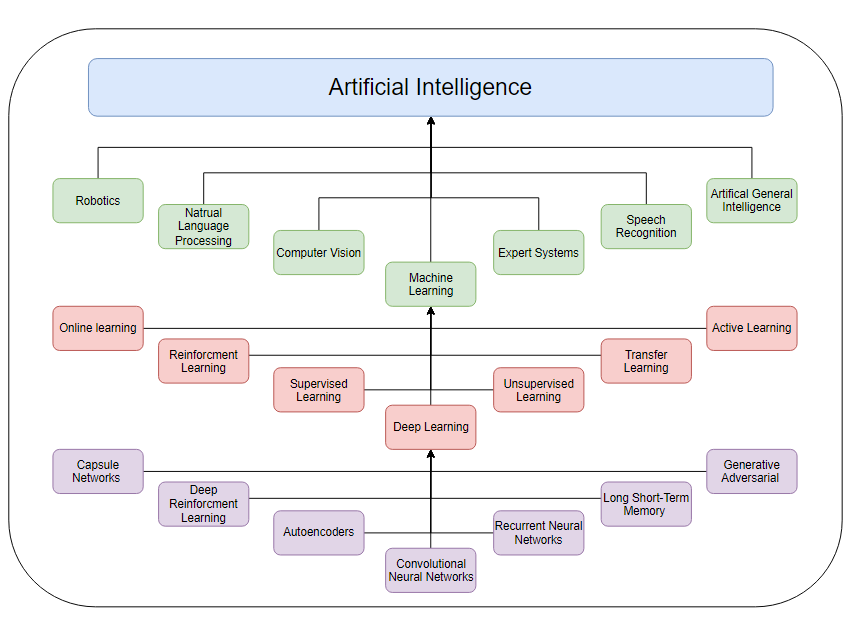
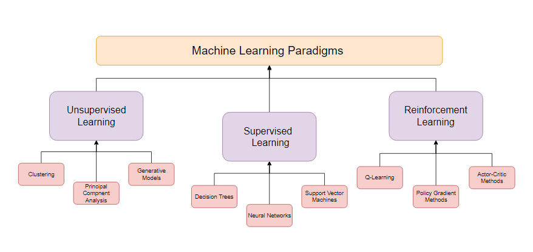

# Welcome to my Data Science Journey.
This repository is a place for me to experiment, document, take notes, and just have fun with any 
machine learning models or deep learning models that I find interesting.

# A General Introduction

I created the image above to help me have a better grasp at the AI umbrella. Let's break down each section listed 

## AI Breakdown :computer: ##
- __**Machine Learning (ML)**__: A type of AI that involves training algorithms to learn patterns in data and 
  make predictions or decisions based on that data.
- __**Natural Language Processing (NLP)**__: A branch of AI that focuses on enabling machines to understand, 
  interpret, and generate human language.
- __**Computer Vision**__: A subset of AI that involves enabling machines to recognize and interpret visual 
  data from images or videos.
- __**Robotics**__: A field of AI that involves designing and building robots that can perform tasks
  autonomously or with minimal human input.
- __**Expert Systems**__: AI systems that can replicate the decision-making abilities of human experts in 
  specific domains by using knowledge and rules to make decisions.
- __**Speech Recognition**__: A subset of AI that focuses on enabling machines to recognize and interpret human speech.
- __**Artificial General Intelligence (AGI)**__: A hypothetical type of AI that would have the same level of intelligence 
  and general cognitive abilities as a human being.

## Machine Learning Breakdown (ML) :robot:  ##
- __**Supervised Learning:**__ A type of machine learning where the algorithm is trained on labeled data, and the goal is to make
predictions or classify new, unlabeled data.
- __**Unsupervised Learning:**__ A type of machine learning where the algorithm is trained on unlabeled data, and the goal is to 
discover patterns or structures in the data.
- __**Reinforcement Learning:**__ A type of machine learning where an agent learns to make decisions based on feedback from the 
environment in the form of rewards or penalties.
- __**Transfer Learning:**__ A type of machine learning where a pre-trained model is used as a starting point for a new, related 
task to reduce the amount of new data needed to achieve high performance.
- __**Online Learning:**__ A type of machine learning where the algorithm is updated continuously as new data becomes available.
- __**Active Learning:**__ A type of machine learning where the algorithm selects the most informative examples from a large pool 
of unlabeled data to improve performance.
- __**Deep Learning:**__ A subset of machine learning that uses neural networks with multiple layers to process complex data and 
make more accurate predictions.

## Deep Learning Breakdown (DL) :brain: ##
- __**Convolutional Neural Networks (CNNs):**__ A type of deep learning network that is commonly used in computer 
vision tasks, such as image classification, object detection, and segmentation.
- __**Recurrent Neural Networks (RNNs):**__ A type of deep learning network that is commonly used in natural language 
processing tasks, such as language translation, speech recognition, and text generation.
- __**Long Short-Term Memory (LSTM) Networks:**__ A type of recurrent neural network that is designed to handle the 
problem of vanishing gradients in traditional RNNs and is commonly used in tasks that involve sequential data.
- __**Generative Adversarial Networks (GANs):**__ A type of deep learning network that involves training two 
neural networks, one to generate new data, and another to distinguish between real and fake data. GANs are 
commonly used in tasks such as image synthesis, video generation, and text generation.
- __**Auto-encoders:**__ A type of deep learning network that is designed to reconstruct input data from a compressed 
representation. Auto-encoders are commonly used in tasks such as image denoising, anomaly detection, and dimensionality 
reduction.
- __**Deep Reinforcement Learning:**__ A type of deep learning that combines reinforcement learning with deep
neural networks to enable agents to learn from experience and make decisions based on rewards or penalties.
Deep reinforcement learning is commonly used in tasks such as game playing, robotics, and autonomous driving.

## ML vs DL  :boxing_glove: ##
- Machine learning models are typically simpler and less complex than deep learning models. They involve the use of 
statistical techniques to train algorithms to make predictions or decisions based on patterns in data.
-  **_A neural network is a subset of machine learning, and deep learning is a subset of neural networks._**
- On the other hand, deep learning models are more complex and involve the use of neural networks with multiple layers to
process large amounts of data and extract features that are used to make predictions or decisions. 
- Deep learning models include __**convolutional neural networks (CNNs)**__ for image and video processing, __**recurrent neural networks (RNNs)**__ for 
sequential data processing, and __**generative adversarial networks (GANs)**__ for generating new data. 
- In summary, machine learning models use statistical techniques to learn patterns in data and make predictions, while deep learning models 
use neural networks with multiple layers to extract features and make more complex predictions or decisions.

# Machine Learning Paradigms in Depth

## Supervised Learning  ## 
### Neural Networks ###
- info goes here 
### Decision Trees ###
- info goes here 
### Support Vector Machines (SVM) ###
- info goes here 

## Unsupervised Learning ## 
### Clustering ###
- info goes here 
### Principal Component Analysis ###
- info goes here 
### Generative Models ###
- info goes here 

## Reinforcement Learning ## 
### Q-Learning ###
- info goes here 
### Policy Gradient Methods ###
- info goes here 
### Actor-Critic Methods ###
- info goes here 

# The Transformer Architecture in Deep Learning Neural Networks
The transformer architecture is a type of deep learning model that was introduced in a paper by Vaswani et al. in 2017. The transformer was designed specifically for natural language processing tasks, such as language translation and text summarization, and has since become a popular architecture for a wide range of sequence modeling tasks.

The transformer architecture is based on the self-attention mechanism, which allows the model to selectively attend to different parts of the input sequence when making predictions. Self-attention allows the model to capture long-range dependencies in the input sequence, which is important for many natural language processing tasks.

The transformer architecture consists of an encoder and a decoder. The encoder takes in an input sequence of tokens, such as words or characters, and generates a set of hidden representations that capture the semantics of the input sequence. The decoder takes in the encoder outputs and generates an output sequence of tokens that corresponds to the desired output.
